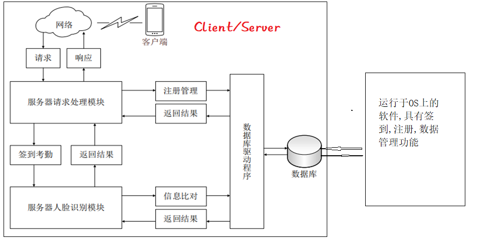
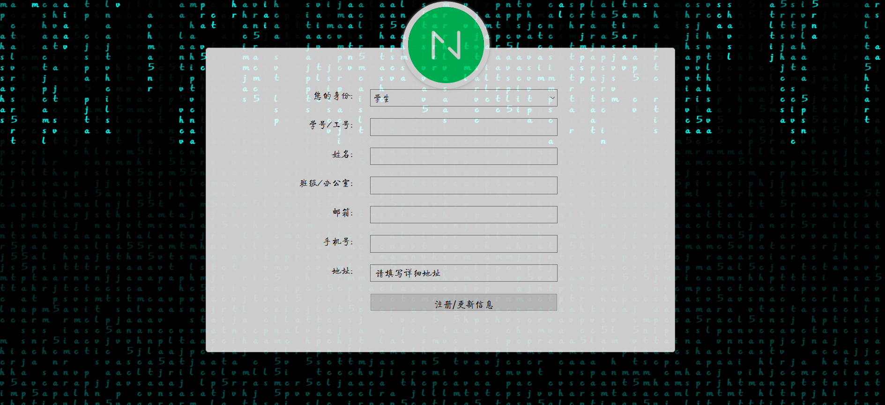
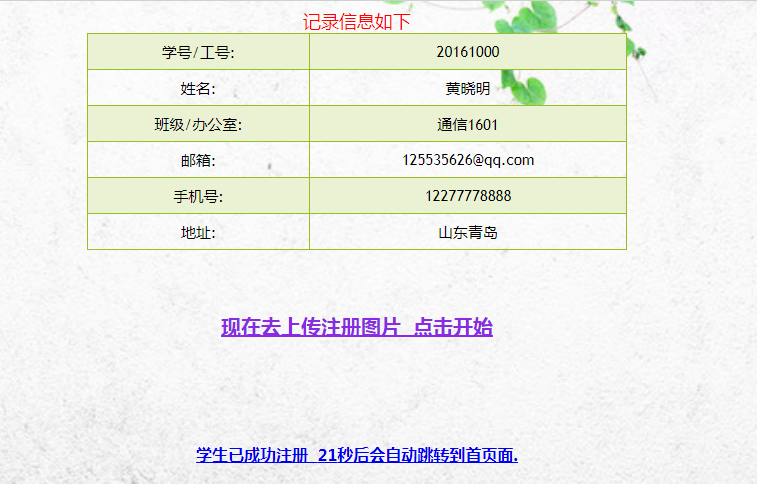
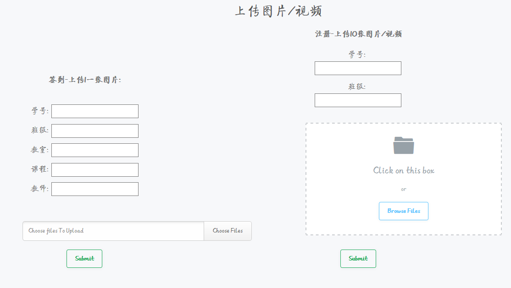
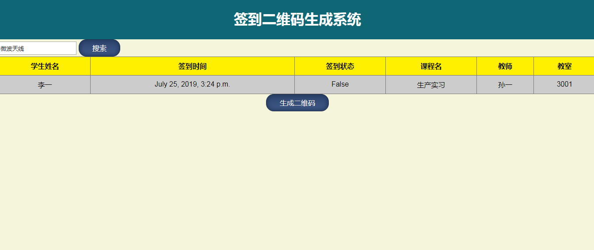
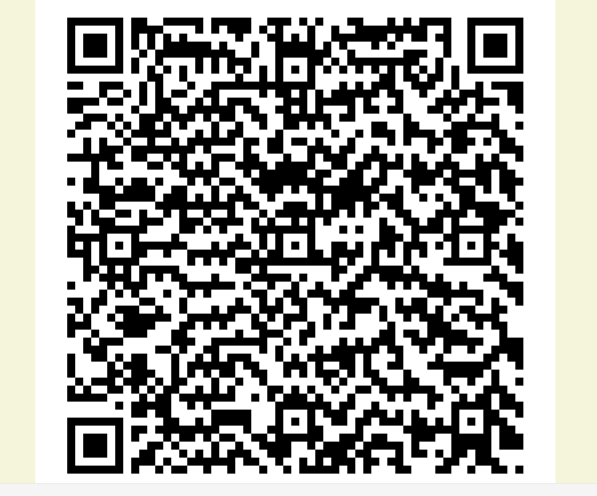
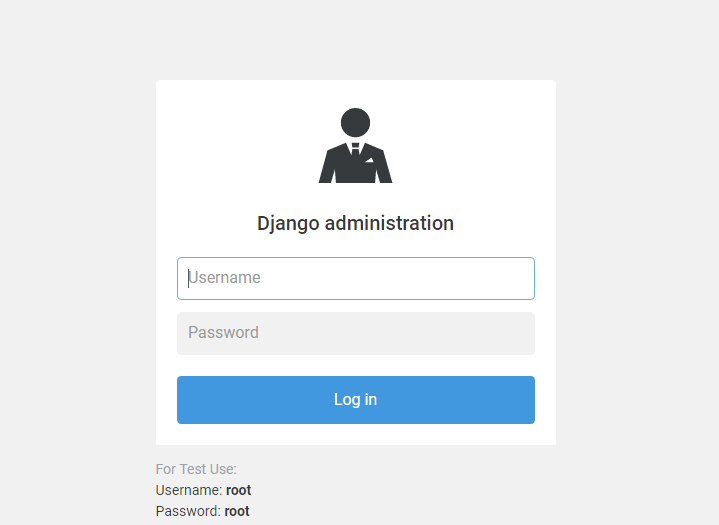
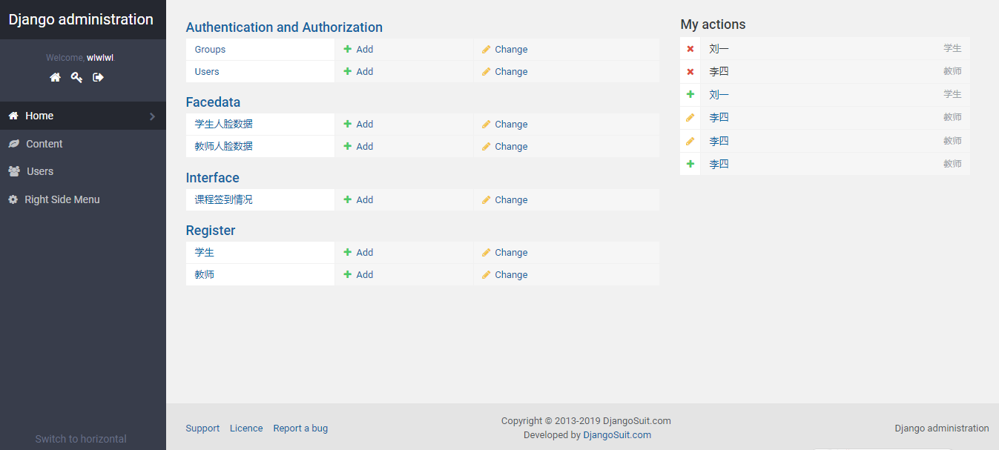
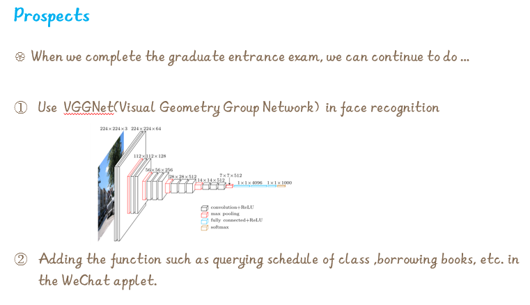

# Face Detect Server
 
### 介绍

这是一个人脸识别的服务端程序,基于Django 2.2开发,后台管理 使用Django Suit V2.

### 系统结构

### 识别算法
使用OpenCV下的Local Binary Patterns Histograms(局部二值模式直方图)

算法具体介绍在：https://docs.opencv.org/3.0-beta/modules/face/doc/facerec/facerec_tutorial.html?highlight=applycolormap#id38

### 主要使用到的库
Django==2.2.3

django-select2==7.1.0

django-suit==2.0a1

opencv-contrib-python==4.1.0.25

qrcode==6.1

### 系统展示

####首页
 

1选择“信息注册”：
 
身份可以选择“学生”或“老师”，填写信息提交后：
 
 
 注册成功返回：
 

2选择“手动签到”：
 
可以选择“签到”或“注册”

3选择“签到二维码”：
 
搜索“生产实习”课程，可看到自己的签到情况：

 
点击“生成二维码”：

4选择“后台管理”:

 
填写用户名和密码，提交：

### 后续改进

### GUI客户端

使用PyQt开发，地址：
https://github.com/lijinxi1/OpenCV_Recongnition

 
 
